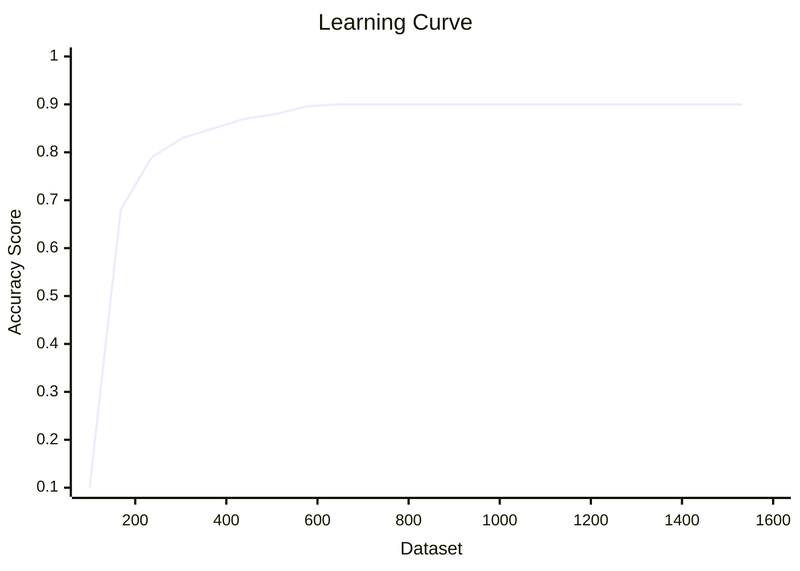

# ML

## Introduction to Machine Learning

- **Definition of ML:** a field of study that gives computers the ability to learn from data without being explicitly programmed (Arthur Samuel).
- A program is said to **learn** from experience $E$ with respect to task $T$ and performance measure $P$ if its performance on $T$ improves with $E$ (Tom Mitchell).

**Workflow:**
1. Collect / gather data
2. Clean and preprocess data
3. Split into training and testing sets
4. Train the model
5. Evaluate performance
6. Tune / improve and deploy

**Types of ML:**
- Supervised learning — labelled data (regression, classification)
- Unsupervised learning — unlabelled data (clustering, dimensionality reduction)
- Reinforcement learning — agent learns from rewards and punishments

---

## Gradient Descent

- Gradient descent is used to optimise results by iteratively updating the parameters in the direction that reduces the cost.

### Learning Rate

- Controls how large a step gradient descent takes in each iteration.
- **Too large** → the model overshoots the minimum and may never converge (diverge).
- **Too small** → training becomes very slow.
- Gradient descent minimises the cost function:
    - $J(w,b) = \frac{1}{2m} \sum_{i=1}^{m} (y_{pred}^{(i)} - y^{(i)})^2$
- Parameter update rule:
    - $w = w - \alpha \frac{\partial J}{\partial w}$

### Batch

- It completes all the iterations over the entire training set and then updates the model (tells us the extent of the error).

- **Advantages of batch:**
    - Accuracy
    - Training is simple and smooth
    - Convergence
    - Easy to implement

- **Disadvantages of batch:**
    - It's slow, especially for large datasets
    - It requires more memory
    - It's not suitable for real-time data

---

### Stochastic

- For every iteration (each training example), it computes the gradient and updates the parameters immediately.

- **Advantages of stochastic:**
    - It can be used for real-time data
    - Instantly see the progress of the model
    - Low chances of premature convergence
    - Faster
    - Suitable for larger datasets

- **Disadvantages of stochastic:**
    - Chances of noisy gradient signals

---

### Mini-batch

- The preferred way
- Divides the data into manageable groups (mini-batches), then measures the error and improves after each group

- **Advantages of mini-batch:**
    - More robust convergence
    - Avoids local minima
    - More computationally efficient

- **Disadvantages of mini-batch:**
    - Additional parameters needed

| Hours | Marks | Pred | Difference |
| ----- | ----- | ---- | ---------- |
| 1     | 10    | 12   | 2          |
| 2     | 20    | 18   | -2         |
| 3     | 30    | 28   | -2         |
| 4     | 40    | 35   | -5         |
| 5     | 50    | 48   | -2         |
<!-- zen:cols=165,182,145,96 -->

---

## Multiple Linear Regression

- $y = b_0 + b_1x$ (Linear Regression)
- $y = b_0 + b_1x_1 + b_2x_2 + ... + b_nx_n$
- $b_0$ = intercept
- $b_nx_n$ = slope

> In this case, $x_1$ = No. of hours, $x_2$ = Attendance, and $x_3$ = Previous marks.

**Q:** No. of hours = 6, Attendance = 80%, Previous marks = 70. Calculate the final marks.

Assume $b_0 = 10$, $b_1 = 5$, $b_2 = 0.2$ and $b_3 = 0.5$.

**Solution:**
- $y = b_0 + b_1x_1 + b_2x_2 + b_3x_3$
- $y = 10 + 5(6) + 0.2(80) + 0.5(70)$
- $y = 10 + 30 + 16 + 35 = 91$

**A:**

| Emp | Exp (x1) | Skill (x2) | Salary (y) |
| --- | -------- | ---------- | ---------- |
| A   | 1        | 2          | 20         |
| B   | 2        | 1          | 25         |
| C   | 3        | 4          | 35         |
| D   | 4        | 3          | 40         |
| E   | 5        | 5          | 50         |

Now:
- Mean of $x_1$ = 3
- Mean of $x_2$ = 3
- Mean of $y$ = 34

And:
- $S_{11} = \sum (x_1-\bar{x}_1)^2$
- $S_{22} = \sum (x_2-\bar{x}_2)^2$
- $S_{12} = \sum (x_1-\bar{x}_1)(x_2-\bar{x}_2)$
- $S_{1y} = \sum (x_1-\bar{x}_1)(y-\bar{y})$
- $S_{2y} = \sum (x_2-\bar{x}_2)(y-\bar{y})$

So:

|     | $x_1 - \bar{x}_1$ $(d_1)$ | $x_2 - \bar{x}_2$ $(d_2)$ | $y - \bar{y}$ $(d_3)$ | $d_1^2 (S_{11})$ | $d_2^2 (S_{22})$ | $d_1 \cdot d_2 (S_{12})$ | $d_1 \cdot d_3 (S_{1y})$ | $d_2 \cdot d_3 (S_{2y})$ |
| --- | ------------------------- | ------------------------- | --------------------- | ---------------- | ---------------- | ------------------------ | ------------------------ | ------------------------ |
| A   | -2                        | -1                        | -14                   | 4                | 1                | 2                        | 28                       | 14                       |
| B   | -1                        | -2                        | -9                    | 1                | 4                | 2                        | 9                        | 18                       |
| C   | 0                         | 1                         | 1                     | 0                | 1                | 0                        | 0                        | 1                        |
| D   | 1                         | 0                         | 6                     | 1                | 0                | 0                        | 6                        | 0                        |
| E   | 2                         | 2                         | 16                    | 4                | 4                | 4                        | 32                       | 32                       |
| $\sum$ | 0                       | 0                         |                       | 10               | 10               | 8                        | 75                       | 65                       |
<!-- zen:cols=48,121,131,106,48,64,72,81,84 -->

---

## Learning Curves

- The learning curve model of ML shows how the error in prediction changes as the size of the training set increases or decreases.

### Bias

- Average of the difference between the average value and the predicted value.
- Lower bias → better model

### Variance

- How the model's predictions change with the size of the dataset.
- Lower variance → better model

### Bias-Variance Trade-off

- We need a bigger dataset for low bias in the model.
- The bigger the dataset, the more the variance.
- Learning curves help find the dataset size that achieves the bias-variance trade-off.



- A good model finds the right spot.

---

## Polynomial Regression

- One dependent, one independent variable
- In this, it is modelled as an $n^{th}$ degree polynomial.
- $b_0 + b_1x^1 + b_2x^2 + b_3x^3 + ... + b_nx^n$, where:
    - $b_0$ = intercept
    - $n$ = degree of the equation
    - $b_1, b_2, ...$ = coefficients
- The graph of a polynomial regression is **always** a curve.

**Example:**

|        | Exp (x) | Salary (y) | $x^2$ | $x^3$ | $x^4$ | $xy$  | $x^2y$  |
| ------ | ------- | ---------- | ----- | ----- | ----- | ----- | ------- |
|        | 1       | 20         | 1     | 1     | 1     | 20    | 20      |
|        | 2       | 25         | 4     | 8     | 16    | 50    | 100     |
|        | 3       | 35         | 9     | 27    | 81    | 105   | 315     |
|        | 4       | 40         | 16    | 64    | 256   | 160   | 640     |
|        | 5       | 50         | 25    | 125   | 625   | 250   | 1250    |
| $\sum$ | 15      | 170        | 55    | 225   | 979   | 585   | 2325    |

- $\sum y = nb_0 + b_1\sum x + b_2\sum x^2$
- $\sum xy = b_0\sum x + b_1\sum x^2 + b_2\sum x^3$
- $\sum x^2y = b_0\sum x^2 + b_1\sum x^3 + b_2\sum x^4$

**Normal form:** $y = b_0 + b_1x^1 + b_2x^2$

**Equations:**
- $5b_0 + 15b_1 + 55b_2 = 170$
- $15b_0 + 55b_1 + 225b_2 = 585$
- $55b_0 + 225b_1 + 979b_2 = 2325$

---

## Regularization

- It is a technique used in ML to prevent overfitting, which otherwise causes models to perform poorly on unseen data.
- Benefits:
    - Removes overfitting
    - Improves generalisation

### Terms

- **Under-fitting:** the model is too simple — high bias, performs poorly even on the training data.
- **Appropriate-fitting:** the model captures the underlying pattern and generalises well to unseen data.
- **Over-fitting:** the model is too complex — it memorises the noise in the training data, so it performs well on training but poorly on unseen data.

### Techniques for Regularization

#### Lasso Regression

- **Least Absolute Shrinkage and Selection Operator** — adds the absolute values of the magnitudes of the coefficients as a penalty to the loss function:
    - $MSE + \lambda \sum |W_j|$

> Lasso means less important features may be removed.

#### Ridge Regression

- In this case, squared values are added, shrinking the coefficients.
- $MSE + \lambda \sum |W_j|^2$

#### Elastic Net Regression

- It is a mixture of both **lasso** and **ridge** regression.
- It can remove as well as shrink the coefficients.

#### Early Stopping

- Epoch (reference point from which time is measured)

```mermaid
xychart-beta
    title "Loss over Epochs"
    x-axis "Epochs" 1 --> 10
    y-axis "Loss" 0 --> 1
    line [0.9, 0.6, 0.42, 0.3, 0.22, 0.17, 0.14, 0.12, 0.11, 0.1]
```

### Steps

- Split the database
- Train the model
- Testing (Evaluating)
- Comparison with the best performance or performance matrix
- Check the patience level (whether the evaluation matrix is improving or not)

---

## Classification

- Supervised machine learning method
- Labeling

### Types

- Binary classification
    - Exactly 2 classes, e.g., spam or not spam, pass or fail
- Multi-class classification
    - More than 2 exclusive classes, e.g., classify an image as cat, dog or bird
- Multi-label classification
    - One instance can belong to multiple classes at once, e.g., a photo containing a dog and a cat gets both labels

---

## Regression

- Odds: probability of an event happening / probability of the event not happening
    - $\text{Odds}(x) = \frac{P(x)}{1-P(x)}$
- Take the log of the odds formula:
    - $\log\left(\frac{P(x)}{1-P(x)}\right) = B_0 + B_1x$
- Take the exponent on both sides:
    - $\frac{P(x)}{1-P(x)} = e^{B_0 + B_1x}$
- Solve for $P(x)$:
    - $P(x) = e^{B_0 + B_1x}(1 - P(x))$
    - $P(x) + P(x) \cdot e^{B_0 + B_1x} = e^{B_0 + B_1x}$
    - $P(x)(1 + e^{B_0 + B_1x}) = e^{B_0 + B_1x}$
    - $P(x) = \frac{e^{B_0 + B_1x}}{1 + e^{B_0 + B_1x}} = \frac{1}{1 + e^{-(B_0 + B_1x)}}$

### Spam, or Not Spam

Worked example of binary classification with logistic regression:

- Each email is scored with a single feature $x$ = number of times the word "FREE" appears.
- The model computes the log-odds:
    - $\log\left(\frac{P}{1-P}\right) = B_0 + B_1x$
- With $B_0 = -4$ and $B_1 = 1$:
    - Email with $x = 2$ → $z = -4 + 2 = -2$
        - $P(\text{spam}) = \frac{1}{1 + e^{-(-2)}} = \frac{1}{1 + e^{2}} \approx 0.12$ → **Not spam**
    - Email with $x = 5$ → $z = -4 + 5 = 1$
        - $P(\text{spam}) = \frac{1}{1 + e^{-1}} \approx 0.73$ → **Spam**
- Decision rule: predict **spam** when $P(\text{spam}) \ge 0.5$, otherwise **not spam**.

| $x$ (FREE count) | $z = B_0 + B_1x$ | $P(\text{spam})$ | Prediction |
| --- | --- | --- | --- |
| 2   | -2  | 0.12 | Not spam |
| 5   | 1   | 0.73 | Spam |
