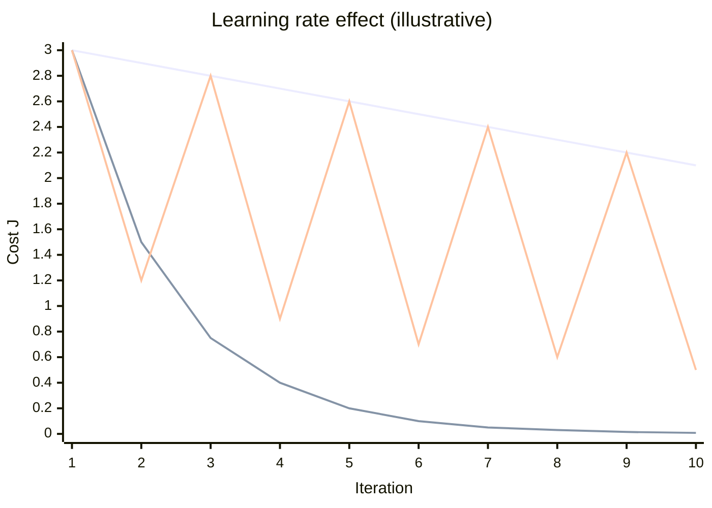

# Gradient Descent

## Topics covered

- Cost function $J(w,b)$ and the update rule $w = w - \alpha \frac{\partial J}{\partial w}$
- Convergence, local and global minima/maxima
- Learning rate $\alpha$ and its effect
- Batch, stochastic and mini-batch gradient descent

## Notes

- Gradient descent is used to optimise results by iteratively updating the parameters in the direction that reduces the cost.

### Cost Function

- Model line: $y_{pred} = wx + b$
- Cost function (MSE): $J(w,b) = \frac{1}{2m} \sum_{i=1}^{m} (y_{pred}^{(i)} - y^{(i)})^2$
- Parameter update rule: $w = w - \alpha \frac{\partial J}{\partial w}$
- Derivative: $\frac{\partial J}{\partial w} = \frac{1}{m} \sum (y_p - y)$
- $J$ is the cost function; gradient descent minimises it.

### Convergence

- **Convergence:** gradually reaching a stable or a final value.
- **Local minima:** lowest point within a neighbourhood.
- **Global minima:** lowest point over the entire surface.
- **Local / Global maxima:** the same ideas for the highest points.

> Diagram: [[Drawing 2026-09-08 09.58.15.excalidraw|local & global minima plot]] (whiteboard sketch from class)

### Learning Rate

- $\alpha$ controls how large a step gradient descent takes in each iteration.
- **Too large** → the model overshoots the minimum and may never converge (diverge).
- **Too small** → training becomes very slow.
- A good learning rate is large enough to converge quickly, small enough not to overshoot.

- **Top (slow decline):** small $\alpha$ — cost drops a little every iteration, converges slowly.
- **Middle (fast drop):** good $\alpha$ — cost falls quickly and flattens near zero.
- **Bottom (oscillating):** large $\alpha$ — cost jumps between high and low values, never settling.

### Variants

#### Batch

- It completes all the iterations over the entire training set and then updates the model (tells us the extent of the error).
- **Advantages:** accuracy, training is simple and smooth, convergence, easy to implement.
- **Disadvantages:** slow especially for large datasets, requires more memory, not suitable for real-time data.

#### Stochastic

- For every iteration (each training example), it computes the gradient and updates the parameters immediately.
- **Advantages:** usable for real-time data, instantly see model progress, low chances of premature convergence, faster, suitable for larger datasets.
- **Disadvantages:** chances of noisy gradient signals.

#### Mini-batch

- The preferred way.
- Divides the data into manageable groups (mini-batches), then measures the error and improves after each group.
- **Advantages:** more robust convergence, avoids local minima, more computationally efficient.
- **Disadvantages:** additional parameters needed.

## Examples worked in class

- Predicted vs. actual marks example:

| Hours | Marks | Pred | Difference |
| ----- | ----- | ---- | ---------- |
| 1     | 10    | 12   | 2          |
| 2     | 20    | 18   | -2         |
| 3     | 30    | 28   | -2         |
| 4     | 40    | 35   | -5         |
| 5     | 50    | 48   | -2         |

## Questions to research

- How does the learning rate $\alpha$ influence the convergence of gradient descent, and what are common strategies for selecting an appropriate learning rate (e.g., learning rate schedules, adaptive methods)?
- Compare batch, stochastic, and mini-batch gradient descent in terms of computational complexity per iteration, memory requirements, and convergence behavior, especially for large datasets.
- What are common reasons why gradient descent might fail to converge to a good solution, and how can techniques like gradient clipping or momentum help address these issues?

## See also

- [[Linear Regression]] — the model being optimised
- [[Multiple Linear Regression]] — cost minimisation with several variables
- [[Learning Curves]] — convergence behaviour vs. dataset size