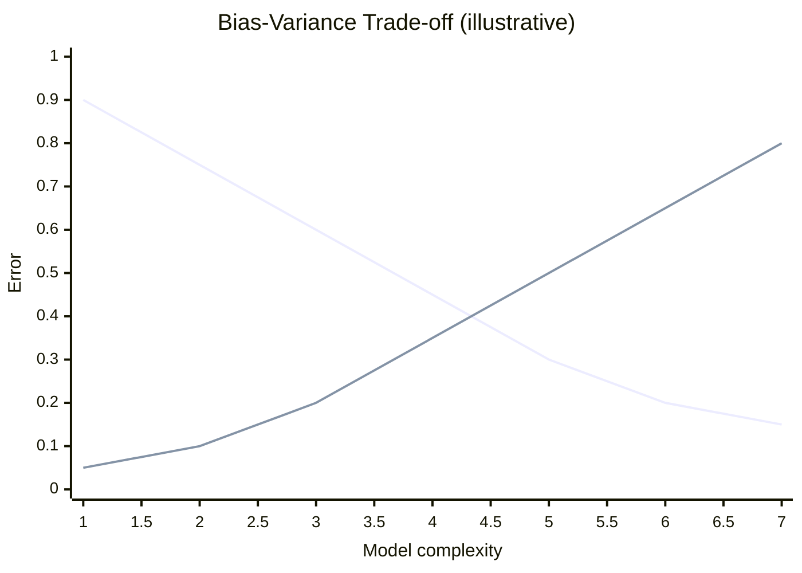
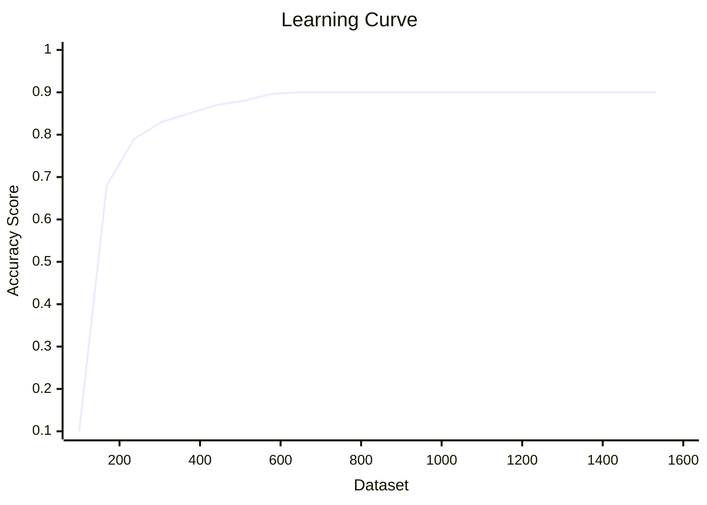

# Learning Curves

## Topics covered

- Bias (under-fitting) and variance (over-fitting)
- The bias-variance trade-off
- How the error changes with training-set size

## Notes

- The learning curve model of ML shows how the **error in prediction** changes as the **size of the training set** increases or decreases.

### Bias

- Average of the difference between the average value and the predicted value.
- Lower bias → better model.

### Variance

- How the model's predictions change with the size of the dataset.
- Lower variance → better model.

### Bias-Variance Trade-off

- We need a bigger dataset for low bias in the model.
- The bigger the dataset, the more the variance.
- Learning curves help find the dataset size that achieves the bias-variance trade-off.
- **A good model finds the right spot** between bias and variance.

- **Descending line (bias):** error from under-fitting — high when the model is too simple.
- **Rising line (variance):** error from over-fitting — high when the model is too complex.
- A good model sits near the crossing, where **both** errors are low.

## Examples worked in class

- **High bias (under-fitting):** Both training and validation error are high and converge to a similar value as training set size increases. Adding more data does not significantly improve performance.
- **High variance (over-fitting):** Training error is low but validation error is much higher. As training set size increases, training error may increase slightly while validation error decreases, converging toward the training error.
- **Ideal case:** Both training and validation error decrease with training set size and converge to a low value, indicating good bias-variance trade-off.

## Questions to research

- How can you distinguish between a model suffering from high bias versus high variance by examining its learning curve?
- What changes would you expect to see in the learning curve if you increased the model complexity (e.g., added polynomial features) while keeping the training set size fixed?
- Why does the validation error eventually decrease with increasing training set size even for a complex model, and what does this indicate about the bias-variance trade-off?

## See also

- [[Regularization]] — fixing under-fitting / over-fitting
- [[Gradient Descent]] — convergence over training