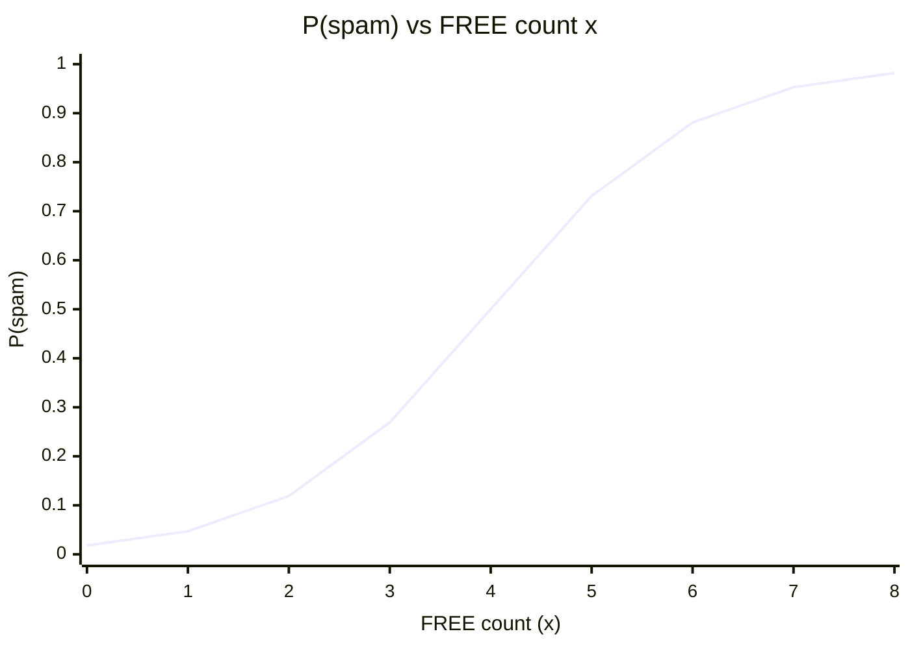

# Logistic Regression

## Topics covered

- From odds to probability: the full derivation
- The sigmoid function and the decision rule
- Spam / not-spam example

## Notes

- Despite the name, it is used for **classification**, not regression — it outputs a probability between 0 and 1.
- Related to [[Linear Regression]]: instead of predicting $y$ directly, it models the log-odds of $y$ linearly, then maps to a probability with the **sigmoid** function.

### From Odds to Probability

- **Odds:** probability of an event happening / probability of the event not happening
    - $\text{Odds}(x) = \frac{P(x)}{1-P(x)}$
- Take the log of the odds formula (log-odds / logit):
    - $\log\left(\frac{P(x)}{1-P(x)}\right) = B_0 + B_1x$
- Take the exponent on both sides:
    - $\frac{P(x)}{1-P(x)} = e^{B_0 + B_1x}$
- Solve for $P(x)$:
    - $P(x) = e^{B_0 + B_1x}(1 - P(x))$
    - $P(x) + P(x) \cdot e^{B_0 + B_1x} = e^{B_0 + B_1x}$
    - $P(x)(1 + e^{B_0 + B_1x}) = e^{B_0 + B_1x}$
    - $P(x) = \frac{e^{B_0 + B_1x}}{1 + e^{B_0 + B_1x}} = \frac{1}{1 + e^{-(B_0 + B_1x)}}$

## Examples worked in class

### Spam, or Not Spam

- Each email is scored with a single feature $x$ = number of times the word "FREE" appears.
- The model computes the log-odds: $\log\left(\frac{P}{1-P}\right) = B_0 + B_1x$
- With $B_0 = -4$ and $B_1 = 1$:
    - Email with $x = 2$ → $z = -4 + 2 = -2$
        - $P(\text{spam}) = \frac{1}{1 + e^{-(-2)}} = \frac{1}{1 + e^{2}} \approx 0.12$ → **Not spam**
    - Email with $x = 5$ → $z = -4 + 5 = 1$
        - $P(\text{spam}) = \frac{1}{1 + e^{-1}} \approx 0.73$ → **Spam**
- **Decision rule:** predict **spam** when $P(\text{spam}) \ge 0.5$, otherwise **not spam**.

| $x$ (FREE count) | $z = B_0 + B_1x$ | $P(\text{spam})$ | Prediction |
| --- | --- | --- | --- |
| 2   | -2  | 0.12 | Not spam |
| 5   | 1   | 0.73 | Spam |

**Sigmoid curve for the spam model ($B_0 = -4$, $B_1 = 1$):**

- The curve is monotonic — every extra occurrence of "FREE" raises $P(\text{spam})$ a little.
- It crosses the 0.5 decision boundary at $x = 4$ (where $z = 0$), matching the table: $x = 5$ is well into the **spam** region.
- The flat tails approaching 0 and 1 are why a line cannot model a probability — the sigmoid is S-shaped and stays inside $[0, 1]$.

## Questions to research

- Why is the sigmoid function $\sigma(z) = \frac{1}{1+e^{-z}}$ particularly suited for modeling probabilities in classification, and what properties does it have?
- How does changing the decision threshold (e.g., from 0.5 to 0.3) affect the trade-off between precision and recall in logistic regression?
- Compare logistic regression and linear regression for binary classification: why does linear regression potentially produce predictions outside the [0,1] range?

## See also

- [[Classification]] — binary / multi-class / multi-label
- [[Linear Regression]]
- [[Regularization]]