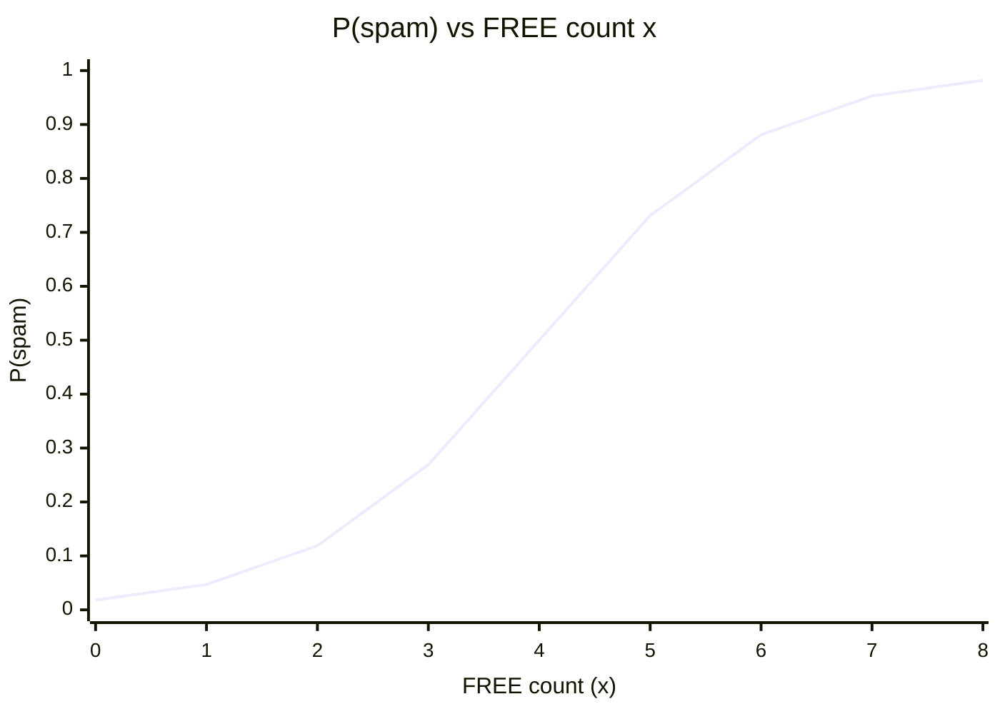

# Logistic Regression

## Topics covered

- From odds to probability: the full derivation
- The sigmoid function and the decision rule
- Log loss / binary cross-entropy as the cost function
- Decision boundaries and how the threshold places them
- Softmax regression for multi-class problems
- Spam / not-spam example

## Notes

- Despite the name, it is used for **classification**, not regression — it outputs a probability between 0 and 1.
- Related to [[Linear Regression]]: instead of predicting $y$ directly, it models the log-odds of $y$ linearly, then maps to a probability with the **sigmoid** function.

### From Odds to Probability

- **Odds:** probability of an event happening / probability of the event not happening
    - $\text{Odds}(x) = \frac{P(x)}{1-P(x)}$
- Take the log of the odds formula (log-odds / logit):
    - $\log\left(\frac{P(x)}{1-P(x)}\right) = B_0 + B_1x$
- Take the exponent on both sides:
    - $\frac{P(x)}{1-P(x)} = e^{B_0 + B_1x}$
- Solve for $P(x)$:
    - $P(x) = e^{B_0 + B_1x}(1 - P(x))$
    - $P(x) + P(x) \cdot e^{B_0 + B_1x} = e^{B_0 + B_1x}$
    - $P(x)(1 + e^{B_0 + B_1x}) = e^{B_0 + B_1x}$
    - $P(x) = \frac{e^{B_0 + B_1x}}{1 + e^{B_0 + B_1x}} = \frac{1}{1 + e^{-(B_0 + B_1x)}}$

### Probability Estimation

- The model's output is exactly a probability estimate: $\hat{p} = \sigma(z)$ with $z = B_0 + B_1x$.
- $z > 0$ → $\hat{p} > 0.5$ (positive class more likely); $z < 0$ → $\hat{p} < 0.5$ (negative class more likely).
- The same $\hat{p}$ is used for the decision rule and appears in the log-loss below.

### Cost Function (Log Loss / Binary Cross-Entropy)

- Squared error is a poor fit for logistic regression: the sigmoid makes the cost surface non-convex, so [[Gradient Descent]] can get stuck in local minima.
- Instead, use **log loss** (binary cross-entropy):
    - $J(B) = -\frac{1}{m} \sum_{i=1}^{m} \left[ y^{(i)} \log(\hat{p}^{(i)}) + (1 - y^{(i)}) \log(1 - \hat{p}^{(i)}) \right]$
    - $y^{(i)} \in \{0, 1\}$ = true label, $\hat{p}^{(i)}$ = predicted probability, $m$ = number of examples.
- Intuition:
    - If $y = 1$ but $\hat{p}$ is small, $\log(\hat{p})$ is very negative → large penalty (confidence in the wrong class costs a lot).
    - If $y = 0$ but $\hat{p}$ is close to 1, $\log(1 - \hat{p})$ blows up → same large penalty.
    - Correct, confident predictions contribute almost nothing to the cost.
- This function is **convex**, so gradient descent reliably converges to the global minimum.

### Decision Boundaries

- The decision rule $\hat{p} \ge 0.5$ ⟺ $z = B_0 + B_1x \ge 0$; the **decision boundary** is the set of points where $z = 0$.
- For the spam example: $z = -4 + x = 0$ → boundary at $x = 4$ — exactly where the sigmoid graph crosses 0.5.
- With more features $z = B_0 + B_1x_1 + B_2x_2$, the boundary becomes a **line in 2-D** ($B_0 + B_1x_1 + B_2x_2 = 0$), and a **hyperplane** in higher dimensions.
- Changing the threshold (e.g., 0.3 instead of 0.5) shifts the boundary — trading recall against precision (see [[Error Analysis]]).

### Softmax Regression (Multi-class)

- Logistic regression generalises to $K > 2$ mutually exclusive classes via the **softmax** function instead of the sigmoid.
- Each class gets its own weight vector; scores are $z_k = B_{k0} + B_{k1}x_1 + \dots + B_{kn}x_n$ for $k = 1..K$.
- Probabilities over all classes:
    - $\hat{p}_k = \frac{e^{z_k}}{\sum_{j=1}^{K} e^{z_j}}$
- Prediction: $\hat{y} = \arg\max_k \hat{p}_k$ (the class with the highest probability).
- The sigmoid is a special case of softmax with $K = 2$.
- Cost: cross-entropy, $J = -\frac{1}{m} \sum_{i=1}^{m} \sum_{k=1}^{K} y_k^{(i)} \log(\hat{p}_k^{(i)})$, where $y_k^{(i)}$ is a one-hot label.

## Examples worked in class

### Spam, or Not Spam

- Each email is scored with a single feature $x$ = number of times the word "FREE" appears.
- The model computes the log-odds: $\log\left(\frac{P}{1-P}\right) = B_0 + B_1x$
- With $B_0 = -4$ and $B_1 = 1$:
    - Email with $x = 2$ → $z = -4 + 2 = -2$
        - $P(\text{spam}) = \frac{1}{1 + e^{-(-2)}} = \frac{1}{1 + e^{2}} \approx 0.12$ → **Not spam**
    - Email with $x = 5$ → $z = -4 + 5 = 1$
        - $P(\text{spam}) = \frac{1}{1 + e^{-1}} \approx 0.73$ → **Spam**
- **Decision rule:** predict **spam** when $P(\text{spam}) \ge 0.5$, otherwise **not spam**.

| $x$ (FREE count) | $z = B_0 + B_1x$ | $P(\text{spam})$ | Prediction |
| --- | --- | --- | --- |
| 2   | -2  | 0.12 | Not spam |
| 5   | 1   | 0.73 | Spam |

**Sigmoid curve for the spam model ($B_0 = -4$, $B_1 = 1$):**

- The curve is monotonic — every extra occurrence of "FREE" raises $P(\text{spam})$ a little.
- It crosses the 0.5 decision boundary at $x = 4$ (where $z = 0$), matching the table: $x = 5$ is well into the **spam** region.
- The flat tails approaching 0 and 1 are why a line cannot model a probability — the sigmoid is S-shaped and stays inside $[0, 1]$.

## Questions to research

- Why is the sigmoid function $\sigma(z) = \frac{1}{1+e^{-z}}$ particularly suited for modeling probabilities in classification, and what properties does it have?
- How does changing the decision threshold (e.g., from 0.5 to 0.3) affect the trade-off between precision and recall in logistic regression?
- Compare logistic regression and linear regression for binary classification: why does linear regression potentially produce predictions outside the [0,1] range?
- Why does gradient descent on squared error get stuck in local minima for logistic regression, while log loss keeps the problem convex?
- How does softmax regression with $K$ classes relate to training $K$ one-vs-rest logistic regressors, and which approach is preferred?

## See also

- [[Classification]] — binary / multi-class / multi-label
- [[Error Analysis]] — precision / recall and how the threshold trades them off
- [[Linear Regression]]
- [[Regularization]]
- [[Gradient Descent]] — minimising the log-loss cost function