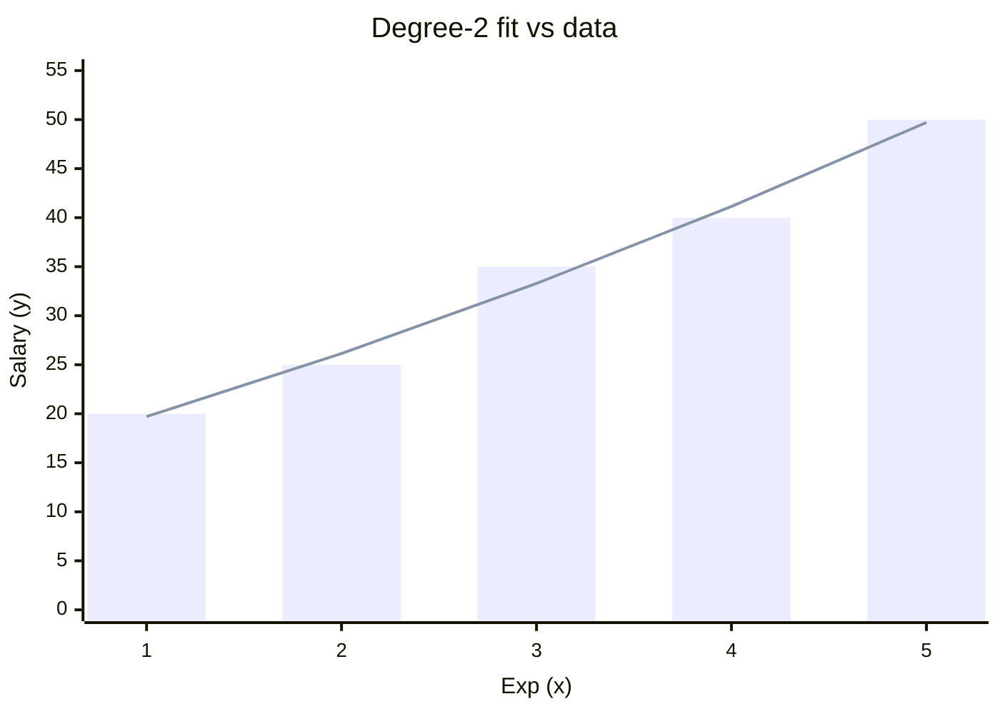

# Polynomial Regression

## Topics covered

- Model form $b_0 + b_1x^1 + b_2x^2 + \dots + b_nx^n$ and degree
- Degree-2 worked example (full computation table)
- Normal equations and the resulting system

## Notes

- One dependent, one independent variable.
- Modelled as an $n^{th}$ degree polynomial — a curved fit rather than a straight line.
- $b_0 + b_1x^1 + b_2x^2 + b_3x^3 + ... + b_nx^n$, where:
    - $b_0$ = intercept
    - $n$ = degree of the equation
    - $b_1, b_2, ...$ = coefficients
- The graph of a polynomial regression is **always** a curve.

### Normal Equations

- $\sum y = nb_0 + b_1 \sum x + b_2 \sum x^2$
- $\sum xy = b_0 \sum x + b_1 \sum x^2 + b_2 \sum x^3$
- $\sum x^2y = b_0 \sum x^2 + b_1 \sum x^3 + b_2 \sum x^4$

## Examples worked in class

### Degree-2 Example

|        | Exp (x) | Salary (y) | $x^2$ | $x^3$ | $x^4$ | $xy$  | $x^2y$  |
| ------ | ------- | ---------- | ----- | ----- | ----- | ----- | ------- |
|        | 1       | 20         | 1     | 1     | 1     | 20    | 20      |
|        | 2       | 25         | 4     | 8     | 16    | 50    | 100     |
|        | 3       | 35         | 9     | 27    | 81    | 105   | 315     |
|        | 4       | 40         | 16    | 64    | 256   | 160   | 640     |
|        | 5       | 50         | 25    | 125   | 625   | 250   | 1250    |
| $\sum$ | 15      | 170        | 55    | 225   | 979   | 585   | 2325    |

**Normal form:** $y = b_0 + b_1x^1 + b_2x^2$

**Equations (from the table above):**

- $5b_0 + 15b_1 + 55b_2 = 170$
- $15b_0 + 55b_1 + 225b_2 = 585$
- $55b_0 + 225b_1 + 979b_2 = 2325$

- Bars = observed salary, line = degree-2 fit from the solved system — use it to check your $b_0$, $b_1$, $b_2$ answers.
- Unlike the straight [[Linear Regression]] line, the fitted values hug the data closely, showing the curve picks up the non-linear trend.

## Questions to research

- Solve the normal-equation system above to find $b_0$, $b_1$ and $b_2$, and check the fitted curve against the data.

## See also

- [[Linear Regression]]
- [[Multiple Linear Regression]]