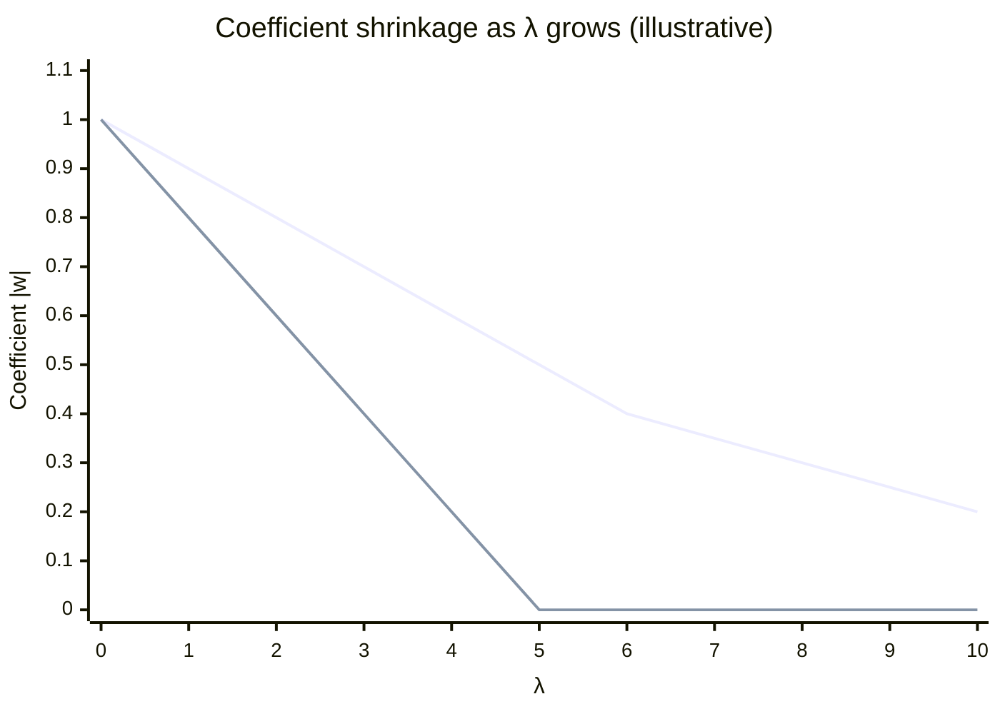

# Regularization

## Topics covered

- Overfitting and why regularization is needed
- Lasso, ridge and elastic net regression
- Early stopping and the workflow steps

## Notes

- A technique used in ML to **prevent overfitting**, which otherwise causes models to perform poorly on unseen data.
- **Benefits:**
    - Removes overfitting
    - Improves generalisation

### Fitting Terms

- **Under-fitting:** the model is too simple — high bias, performs poorly even on the training data.
- **Appropriate-fitting:** the model captures the underlying pattern and generalises well to unseen data.
- **Over-fitting:** the model is too complex — it memorises the noise in the training data, so it performs well on training but poorly on unseen data.

### Lasso Regression

- **Least Absolute Shrinkage and Selection Operator** — adds the absolute values of the magnitudes of the coefficients as a penalty to the loss function:
    - $MSE + \lambda \sum |W_j|$

> Lasso means less important features may be removed.

### Ridge Regression

- In this case, squared values are added, shrinking the coefficients.
- $MSE + \lambda \sum |W_j|^2$

### Elastic Net Regression

- A mixture of both **lasso** and **ridge** regression.
- It can remove as well as shrink the coefficients.



- **Smoothly-curving line (ridge):** the coefficient shrinks steadily but never quite reaches 0 — every feature stays, just weakened.
- **Line that hits 0 (lasso):** once λ crosses a threshold the coefficient becomes exactly 0 — that feature is dropped from the model.

### Early Stopping

- Stop training once the validation loss stops improving, before the model starts overfitting.
- Epoch (reference point from which time is measured).

```mermaid
xychart-beta
    title "Loss over Epochs"
    x-axis "Epochs" 1 --> 10
    y-axis "Loss" 0 --> 1
    line [0.9, 0.6, 0.42, 0.3, 0.22, 0.17, 0.14, 0.12, 0.11, 0.1]
```

**Steps (early stopping workflow):**

1. Split the database
2. Train the model
3. Testing (evaluating)
4. Comparison with the best performance or performance matrix
5. Check the patience level (whether the evaluation matrix is improving or not)

## Examples worked in class

- **Feature selection with Lasso:** Consider a dataset with features $x_1$ (important) and $x_2$ (irrelevant). Lasso regression may shrink the coefficient of $x_2$ to exactly zero, effectively removing it from the model: $y = b_0 + b_1x_1 + 0 \cdot x_2$.
- **Ridge regression for multicollinearity:** When two features are highly correlated, ridge regression shrinks both coefficients toward each other, reducing variance without eliminating either feature.

## Questions to research

- How does the L1 penalty in lasso lead to sparse solutions (some coefficients exactly zero), while the L2 penalty in ridge only shrinks coefficients toward zero?
- When would you choose elastic net over lasso or ridge, and what advantages does it offer in handling correlated features?
- In early stopping, how is the validation loss used to determine when to stop training, and what is the purpose of the 'patience' parameter?

## See also

- [[Learning Curves]] — bias vs. variance
- [[Logistic Regression]] — where regularisation is commonly applied
- [[Classification]]